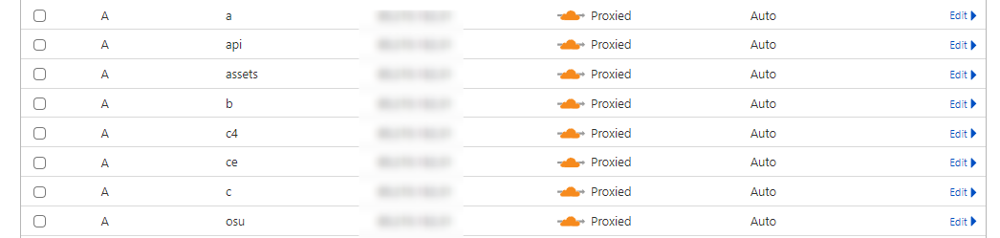

Welcome to the comprehensive installation guide for **osuNoLimits**. This guide will walk you through setting up [Shiina-Web](https://github.com/osu-NoLimits/Shiina-Web) and [bancho.py-ex](https://github.com/osu-NoLimits/bancho.py-ex) from scratch.


!!! warning "Prerequisites"
    Before starting, ensure you have:
    
    - :material-server: A Linux server (Ubuntu 24.04+ recommended)
    - :material-domain: A domain name with DNS access
    - :material-shield-check: Basic command-line knowledge
    - :material-clock: Approximately 30-60 minutes

!!! tip "Get VPS Hosting"
    <a href="https://pay.vps.direct?ref=hersol" target="_blank" rel="nofollow sponsored" style="font-weight: bold; color: #1976d2; text-decoration: underline;">
      Get VPS hosting from our recommended provider
    </a>  
    <br>
    <span style="font-size: 0.95em; color: #666;">
      <em>(This is an affiliate link – if you purchase through it, we may earn a commission at no extra cost to you)</em>
    </span>

## :material-dns: Domain Configuration

Configure the following subdomains to point to your server. We strongly recommend using [Cloudflare](https://www.cloudflare.com/) for DNS management and DDoS protection.

!!! example "Required Subdomains"
    Create these DNS records pointing to your server's IP:
    
    === "A Records"
        | Subdomain | Purpose | Example |
        |-----------|---------|---------|
        | `@` | Main domain | `osunolimits.dev` |
        | `osu` | Game client connection | `osu.osunolimits.dev` |
        | `c` | Game server | `c.osunolimits.dev` |
        | `c4` | Game server | `c4.osunolimits.dev` |
        | `a` | Avatar endpoint | `a.osunolimits.dev` |
        | `assets` | Static assets | `assets.osunolimits.dev` |
        | `api` | Bancho API | `api.osunolimits.dev` |
    
    === "Cloudflare Setup"
        1. Add your domain to Cloudflare
        2. Update nameservers at your registrar
        3. Create the A records listed above
        4. Enable proxy (orange cloud) for web traffic protection

    === "Example"
        

!!! tip "SSL Configuration"
    You can choose between flexible or strict SSL encryption. For production environments, we recommend **Full (Strict)** SSL mode with valid certificates.
    
    📖 [Detailed SSL setup guide](https://github.com/osuAkatsuki/bancho.py/wiki/Post-setup)

!!! note "Version Control Recommendation"
    Create a GitHub fork of the repositories before proceeding. This allows you to:
    
    - :material-source-pull: Easily pull updates
    - :material-pencil: Make custom modifications  
    - :material-backup-restore: Maintain your configuration

## :material-docker: Installing bancho.py-ex


### :material-package-variant-closed: Docker Installation

Docker is required to run bancho.py-ex. Choose your operating system below:

=== ":material-ubuntu: Ubuntu"

    !!! warning "Cleanup First"
        Remove any conflicting Docker packages:
        
    ```bash
    for pkg in docker.io docker-doc docker-compose docker-compose-v2 podman-docker containerd runc; do 
        sudo apt-get remove $pkg
    done
    ```

    **Step 1:** Add Docker's official GPG key and repository
    ```bash
    sudo apt-get update
    sudo apt-get install ca-certificates curl
    sudo install -m 0755 -d /etc/apt/keyrings
    sudo curl -fsSL https://download.docker.com/linux/ubuntu/gpg -o /etc/apt/keyrings/docker.asc
    sudo chmod a+r /etc/apt/keyrings/docker.asc
    ```

    **Step 2:** Add Docker repository to APT sources
    ```bash
    echo \
    "deb [arch=$(dpkg --print-architecture) signed-by=/etc/apt/keyrings/docker.asc] https://download.docker.com/linux/ubuntu \
    $(. /etc/os-release && echo "${UBUNTU_CODENAME:-$VERSION_CODENAME}") stable" | \
    sudo tee /etc/apt/sources.list.d/docker.list > /dev/null
    sudo apt-get update
    ```

    **Step 3:** Install Docker
    ```bash
    sudo apt-get install docker-ce docker-ce-cli containerd.io docker-buildx-plugin docker-compose-plugin
    ```

=== ":material-debian: Debian"

    !!! warning "Cleanup First"
        Remove any conflicting Docker packages:
        
    ```bash
    for pkg in docker.io docker-doc docker-compose podman-docker containerd runc; do 
        sudo apt-get remove $pkg
    done
    ```

    **Step 1:** Add Docker's official GPG key and repository
    ```bash
    sudo apt-get update
    sudo apt-get install ca-certificates curl
    sudo install -m 0755 -d /etc/apt/keyrings
    sudo curl -fsSL https://download.docker.com/linux/debian/gpg -o /etc/apt/keyrings/docker.asc
    sudo chmod a+r /etc/apt/keyrings/docker.asc
    ```

    **Step 2:** Add Docker repository to APT sources
    ```bash
    echo \
    "deb [arch=$(dpkg --print-architecture) signed-by=/etc/apt/keyrings/docker.asc] https://download.docker.com/linux/debian \
    $(. /etc/os-release && echo "$VERSION_CODENAME") stable" | \
    sudo tee /etc/apt/sources.list.d/docker.list > /dev/null
    sudo apt-get update
    ```

    **Step 3:** Install Docker
    ```bash
    sudo apt-get install docker-ce docker-ce-cli containerd.io docker-buildx-plugin docker-compose-plugin
    ```

=== ":material-fedora: Fedora"

    !!! warning "Cleanup First"
        Remove any conflicting Docker packages:
    ```bash
    sudo dnf remove docker \
                  docker-client \
                  docker-client-latest \
                  docker-common \
                  docker-latest \
                  docker-latest-logrotate \
                  docker-logrotate \
                  docker-selinux \
                  docker-engine-selinux \
                  docker-engine
    ```

    **Step 2:** Add Docker repository
    ```bash
    sudo dnf -y install dnf-plugins-core
    sudo dnf config-manager --add-repo https://download.docker.com/linux/fedora/docker-ce.repo
    ```

    **Step 3:** Install Docker
    ```bash
    sudo dnf install docker-ce docker-ce-cli containerd.io docker-buildx-plugin docker-compose-plugin
    ```

    **Step 4:** Enable Docker service
    ```bash
    sudo systemctl enable --now docker
    ```

### :material-web: Nginx Installation

Nginx serves as our web server and reverse proxy. Follow the instructions for your operating system:

=== ":material-ubuntu: Ubuntu & Debian"

    !!! tip "Remove Apache2 (Ubuntu only)"
        If Apache2 is installed, remove it first to avoid conflicts:
        
    ```bash
    sudo systemctl stop apache2
    sudo apt remove apache2 apache2-utils apache2-bin apache2.2-common
    sudo apt autoremove
    ```

    **Step 1:** Update package list and install Nginx
    ```bash
    sudo apt update
    sudo apt install nginx
    ```

    **Step 2:** Verify installation
    ```bash
    sudo systemctl status nginx
    ```

    !!! success "Expected Output"
        You should see `Active: active (running)` in green text.

=== ":material-fedora: Fedora"

    **Step 1:** Update packages and install Nginx
    ```bash
    sudo dnf update
    sudo dnf install nginx
    ```

    **Step 2:** Start and enable Nginx
    ```bash
    sudo systemctl start nginx
    sudo systemctl enable nginx
    ```

    **Step 3:** Configure firewall
    ```bash
    sudo firewall-cmd --permanent --add-service=http
    sudo firewall-cmd --permanent --add-service=https
    sudo firewall-cmd --reload
    ```

    **Step 4:** Verify installation
    ```bash
    sudo systemctl status nginx
    ```

### :material-git: Git Installation

Git is required for cloning the repository and managing updates.

=== ":material-ubuntu: Ubuntu & Debian"

    **Step 1:** Update package list and install Git
    ```bash
    sudo apt update
    sudo apt install git
    ```

    **Step 2:** Verify installation
    ```bash
    git --version
    ```

    !!! success "Expected Output"
        You should see something like `git version 2.34.1`

    **Step 3:** Configure Git (replace with your information)
    ```bash
    git config --global user.name "Your Name"
    git config --global user.email "your.email@example.com"
    ```

=== ":material-fedora: Fedora"

    **Step 1:** Update packages and install Git
    ```bash
    sudo dnf update
    sudo dnf install git
    ```

    **Step 2:** Verify installation
    ```bash
    git --version
    ```

    !!! success "Expected Output"
        You should see something like `git version 2.34.1`

    **Step 3:** Configure Git (replace with your information)
    ```bash
    git config --global user.name "Your Name"
    git config --global user.email "your.email@example.com"
    ```

### :material-download: Repository Setup

Clone the bancho.py-ex repository to your server:

!!! tip "Use Your Fork"
    If you created a fork, replace the URL with your fork's URL for easier updates.

```bash
git clone https://github.com/osu-NoLimits/bancho.py-ex.git /home/bancho-py-ex
cd /home/bancho-py-ex
```

### :material-file-cog: Environment Setup

First, create your configuration files from the provided examples:

```bash
cp .env.example .env
cp logging.yaml.example logging.yaml
```

### :material-pencil: Edit Configuration

Open the environment file for editing:

```bash
nano .env
```

!!! warning "Required Configuration"
    You **must** configure these essential settings before proceeding:

=== ":material-key: Authentication"

    | Setting | Description | Required |
    |---------|-------------|----------|
    | `OSU_API_KEY` | [Get your osu! API key here](https://osu.ppy.sh/home/account/edit) | ✅ |
    | `DB_PASS` | Strong database password | ✅ |
    | `DOMAIN` | Your domain (e.g., `osunolimits.dev`) | ✅ |

=== ":material-shield-lock: SSL Settings (Optional)"

    !!! note "Only required for Full/Strict SSL mode"
    
    ```bash
    SSL_CERT_PATH=/path/to/your/fullchain.crt
    SSL_KEY_PATH=/path/to/your/private.key
    ```

=== ":material-palette: Customization (Optional)"

    | Setting | Description | Example |
    |---------|-------------|---------|
    | `SERVER_NAME` | Your server's display name | `osuNoLimits` |
    | `DISCORD_URL` | Your Discord invite link | `https://discord.gg/yourinvite` |
    | `MENU_ICON_URL` | In-game menu icon | URL to your icon |
    | `MENU_ONCLICK_URL` | Click destination | Your website URL |
    | `SEASONAL_BGS` | Background images | Comma-separated URLs |

=== ":material-webhook: Webhooks (Optional)"

    Configure Discord webhooks for notifications:
    
    ```bash
    FIRST_PLACES_WEBHOOK=https://discord.com/api/webhooks/...
    ENABLE_FIRST_PLACES_WEBHOOK=True
    DISCORD_AUDIT_LOG_WEBHOOK=https://discord.com/api/webhooks/...
    ```

### :material-web-box: Nginx Configuration

Install the pre-configured nginx setup:

```bash
./scripts/install-nginx-config.sh
```

!!! success "Configuration Complete"
    Your nginx configuration has been automatically set up with the correct proxy settings for all bancho.py-ex endpoints.

### :material-hammer-wrench: Build and Start

With everything configured, build and start the project:

```bash
# Build the Docker containers
make build

# Start all services
make run
```

!!! tip "Development vs Production"
    - For **development**: Use `make run` for easier debugging
    - For **production**: Consider using `make run-bg` or `screen -S bancho make run` to run in background

### :material-shield-account: Autoban Configuration

Configure performance point limits to prevent cheating:

```bash
nano caps.json
```

!!! example "PP Caps Configuration"
    ```json
    {
        "enabled": true,
        "caps": {
            "0": 800,    // osu! standard
            "1": 1000,   // osu! taiko  
            "2": 900,    // osu! catch
            "3": 850     // osu! mania
        }
    }
    ```

!!! warning "Important Notes"
    - Set `"enabled": true` to activate automatic banning
    - Adjust PP values based on your server's skill level
    - Monitor logs for any false positives

## :fontawesome-brands-java: Installing Shiina-Web


bancho.py-ex should be installed at this step

### :fontawesome-brands-java: Installing Java

=== ":material-ubuntu: Ubuntu"

    ```bash
    sudo apt install openjdk-21-jdk -y
    ```

=== ":material-debian: Debian"

    ```bash
    echo "deb http://deb.debian.org/debian bullseye-backports main" | sudo tee /etc/apt/sources.list.d/backports.list
    sudo apt update

    # Debian 12
    sudo apt install openjdk-21-jdk -y

    # Debian 11
    sudo apt install -t bullseye-backports openjdk-21-jdk -y
    ```

=== ":material-fedora: Fedora"
    ```bash
    sudo dnf install java-21-openjdk-devel -y
    ```

### :material-download: Repository Setup

Clone the Shiina-Web repository to your server:

!!! tip "Use Your Fork"
    If you created a fork, replace the URL with your fork's URL for easier updates.

```bash
git clone https://github.com/osu-NoLimits/Shiina-Web.git /home/Shiina-Web
cd /home/Shiina-Web
```

### :fontawesome-solid-sliders: Configuration

```bash
# Navigate to the config directory
cd .config

cp .env.example .env && cp customization.yml.example customization.yml && cp logger.env.example logger.env

# Editing customization.yml is pretty obvious (no tutorial here)

nano .env
```


!!! warning "Required Configuration"
    You **must** configure these essential settings before proceeding:

=== ":material-key: Main"

    | Setting | Description | Required |
    |---------|-------------|----------|
    | `TURNSTILE_KEY` | [Get Cloudflare Captcha key here](https://dash.cloudflare.com/sign-up?to=/:account/turnstile) | ✅ |
    | `TURNSTILE_SECRET` | [Get Cloudflare Captcha key here](https://dash.cloudflare.com/sign-up?to=/:account/turnstile) | ✅ |
    | `DBPASS` | Your bancho.py-ex DB_PASS | ✅ |
    | `DOMAIN` | Your domain (def. `https://osunolimits.dev`) | ✅ |
    | `APIURLPUBLIC` | Your pub api domain (def. `https://api.osunolimits.dev`) | ✅ |
    | `ASSETSURL` | Your pub assets domain (def. `https://assets.osunolimits.dev`) | ✅ |
    | `AVATARSRV` | Your pub avatars domain (def. `https://a.osunolimits.dev`) | ✅ |
    

=== ":material-plus: Optional"

    | Setting | Description | Required |
    |---------|-------------|----------|
    | `DOWNLOAD_MARKETPLACE_PLUGIN` | Offers a plugin marketplace (def. `true`) | ❌ |
    | `APIURL` | Local API Host (Should stay default) | ❌ |
    | `AVATARFOLDER` | Avatar folder only needs change when installed not like wiki | ❌ |

### :material-hammer-wrench: Build and Start

With everything configured, build and start the project:

```bash
# Build shiina
make build

# Start the frontend
make run
```

!!! tip "Development vs Production"
    - For **development**: Use `make run-dev` for easier debugging and hot reloading
    - For **production**: Consider using `screen -S shiina make run` to run in background


# Frequently Asked Questions

Here you'll find answers to the most common questions.

---

## Installation

??? question "How can I use local machine MySQL and Redis?"
    To use local MySQL and Redis you can create a `docker-compose.override.yml`
    ```bash
    cd /home/bancho.py-ex
    nano docker-compose.override.yml
    ```

    **File Content:**
    ```yaml
    services:
        bancho:
            depends_on: []
            network_mode: host
            volumes:
            - /home/bancho.py-ex/.data:/srv/root
            - .:/srv/root
            - data:/srv/root/.data
            environment:
            - DB_HOST=127.0.0.1
            - REDIS_HOST=127.0.0.1

        mysql:
            deploy:
            replicas: 0

        redis:
            deploy:
            replicas: 0
    ```
    Now your bancho will use your machines mysql and redis
    
    No worries the `docker-compose.override.yml` is in *.gitignore*

??? question "Why are my assets/avatars not showing up?"
    Fix for Avatar Server (a.your.domain) Returning 404

    If `/var/log/nginx/error.log` reports **permission denied**, run:

    ```bash
    chown www-data:www-data /var/lib/docker/volumes/banchopy-ex_data/_data
    chown www-data:www-data /home/bancho.py-ex/.data
    chmod +x /var/lib/docker/volumes/banchopy-ex_data
    chmod +x /var/lib/docker/volumes
    chmod +x /var/lib/docker
    ```

    What this does:
    - Gives **www-data** (the Nginx user) ownership of the `_data` folder, which is stored inside a Docker volume.  
    - Allows all users on your machine to **browse the bancho.py Docker volume**.  
    - Allows all users on your machine to **browse the Docker volumes folder**.  
    - Allows all users on your machine to **browse the Docker folder**.  
    - *(does not include sub-folders)*  

    Note:
    If you use **Caddy** instead of Nginx, replace all occurrences of `www-data` with `caddy`.


??? question "How can I recieve Donations on shiina?"
    The only provider supported is **kofi**
    ```bash
    nano /home/Shiina-Web/data/monetization.json
    # Set enabled to `true`
    # Restart shiina
    nano /home/Shiina-Web/data/monetization/kofi.json
    ```

    https://ko-fi.com/manage/webhooks?src=sidemenu

    Enter `https://yourdomain.dev/handlekofi`
    
    On *Advanced* you can get your verification token

    File Content
    ```json
    {
        "verificationToken": "your-access-token",
        "pageName": "osunolimits",
        "donationAmount": 1
    }
    ```
    `donationAmount` is the amount of your currency to pay

    If someones buys for 10$ it would equal to 10 months
---

## Usage

??? question "Why is my rank graph not showing?"
    It needs at least a week of data to show

??? question "Can I change code?"
    Yes but it isn't recommended, it can cause issues updating. Use plugins/themes if possible
---

## Troubleshooting

??? question "Can I see frontend logs?"
    Shiina keeps logs for 30days and rotates them
    ```bash
    cd /home/Shiina-Web/logs
    ```

??? question "How can I recalc PP?"
    For recalc you need to open a shell in the docker container
    ```bash
    docker ps
    # Pick the container id that runs bancho
    docker exec -it yourid sh
    # now go into tools
    cd tools/
    python recalc.py
    ```

??? question "How clear frontend sessions/cache?"
    ```bash
    apt install redis-tools # or for your system
    redis-cli
    # now you are in redis terminal
    EVAL "for _,k in ipairs(redis.call('KEYS', 'shiina:*')) do redis.call('DEL', k) end" 0
    # Now you need to restart shiina to initialize some keys
    ```