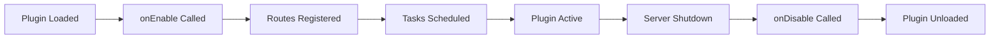

# :material-puzzle: Plugin System

Welcome to the **Shiina-Web Plugin System** documentation! Extend your server's functionality with custom plugins, routes, scheduled tasks, and more.

---

## :material-rocket-launch: What Are Plugins?

Plugins allow you to extend Shiina-Web without modifying the core codebase. Add new features, create custom routes, integrate third-party services, and automate tasks — all through a clean, maintainable plugin architecture.

---

## :material-map-marker-path: Plugin Development Guide

<div class="grid cards" markdown>

-   :material-file-code: **[Creating Plugins](creating-plugins.md)**

    ---

    Learn the basics of plugin development, project structure, and building your first plugin

-   :material-routes: **[Working with Routes](routes.md)**

    ---

    Create custom web routes and API endpoints within your plugins

-   :material-clock-outline: **[Scheduled Tasks](cron-tasks.md)**

    ---

    Implement automated tasks using the built-in cron system

-   :material-file-document-multiple: **[Advanced Topics](advanced.md)**

    ---

    Database access, authentication, frontend integration, and more

</div>

---

## :material-lightbulb: Quick Start

Ready to create your first plugin? Here's what you need to know:

!!! tip "Development Prerequisites"
    - :material-language-java: **Java Development Kit** — JDK 11 or higher
    - :material-language-java: **Apache Maven** — For building plugins
    - :material-code-braces: **IDE** — IntelliJ IDEA, Eclipse, or VS Code recommended

### :material-download: Getting Started

1. **Clone the plugin starter template**
   ```bash
   git clone https://github.com/osu-NoLimits/shiina-plugin/ myplugin/
   cd myplugin/
   ```

2. **Configure your plugin** by editing `plugin.yml`

3. **Build your plugin** with Maven
   ```bash
   mvn package
   ```

4. **Deploy** the generated JAR file to your Shiina-Web plugins directory

:material-arrow-right: **[Full tutorial →](creating-plugins.md)**

---

## :material-feature-search: Plugin Capabilities

!!! success "What You Can Build"
    - :material-web: **Custom Web Pages** — Add new routes and frontend pages
    - :material-api: **REST APIs** — Create API endpoints for integrations
    - :material-database: **Database Access** — Query and modify data safely
    - :material-clock-outline: **Scheduled Tasks** — Automate recurring operations
    - :material-webhook: **Webhooks** — Integrate with external services
    - :material-account-check: **Authentication** — Access user sessions and permissions
    - :material-brush: **Frontend Extensions** — Add custom UI components

---

## :material-package-variant: Plugin Lifecycle

Understanding the plugin lifecycle helps you write better plugins:



!!! info "Lifecycle Methods"
    - **`onEnable()`** — Called when your plugin starts (register routes, initialize resources)
    - **`onDisable()`** — Called when your plugin stops (cleanup, save data)

---

## :material-book-open-variant: Best Practices

!!! tip "Plugin Development Tips"
    - ✅ **Use meaningful names** for plugins, routes, and tasks
    - ✅ **Handle errors gracefully** with try-catch blocks
    - ✅ **Log important events** for debugging and monitoring
    - ✅ **Clean up resources** in the `onDisable()` method
    - ✅ **Test thoroughly** before deploying to production
    - ✅ **Document your plugin** with clear README files

!!! warning "Common Pitfalls"
    - ❌ Don't modify core Shiina-Web files
    - ❌ Avoid blocking operations in request handlers
    - ❌ Don't store sensitive data in plain text
    - ❌ Never skip error handling
    - ❌ Don't forget to update plugin.yml when renaming

---

<div align="center">
    <p style="margin-top: 2em;">
        <em>Start building amazing plugins for your osu! server today!</em>
    </p>
    <p><em>© 2026 Marc Andre Herpers. All rights reserved.</em></p>
</div>
